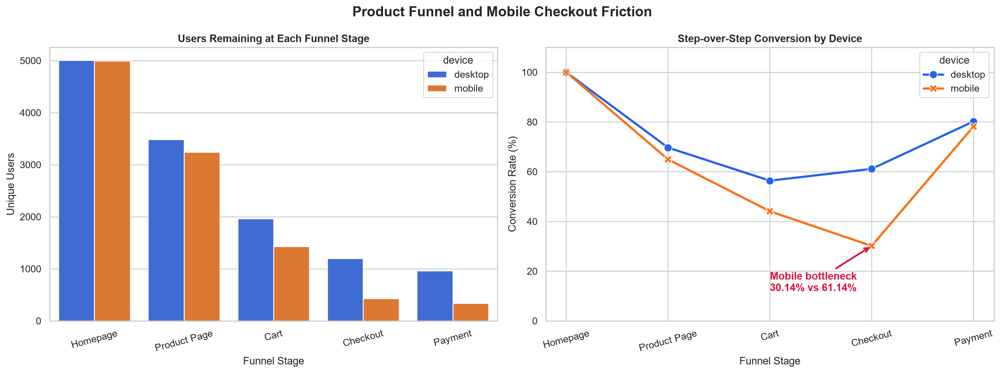
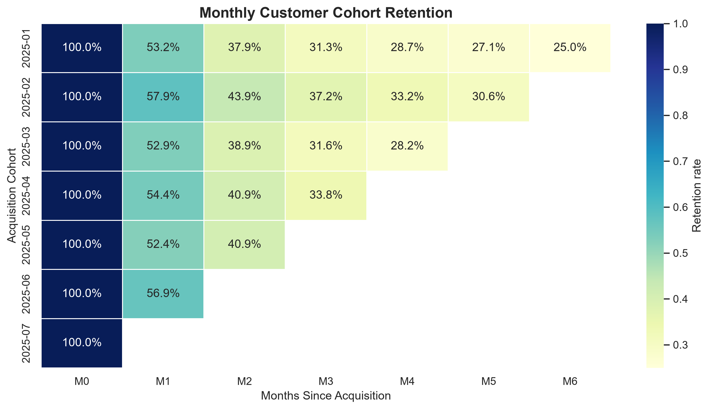
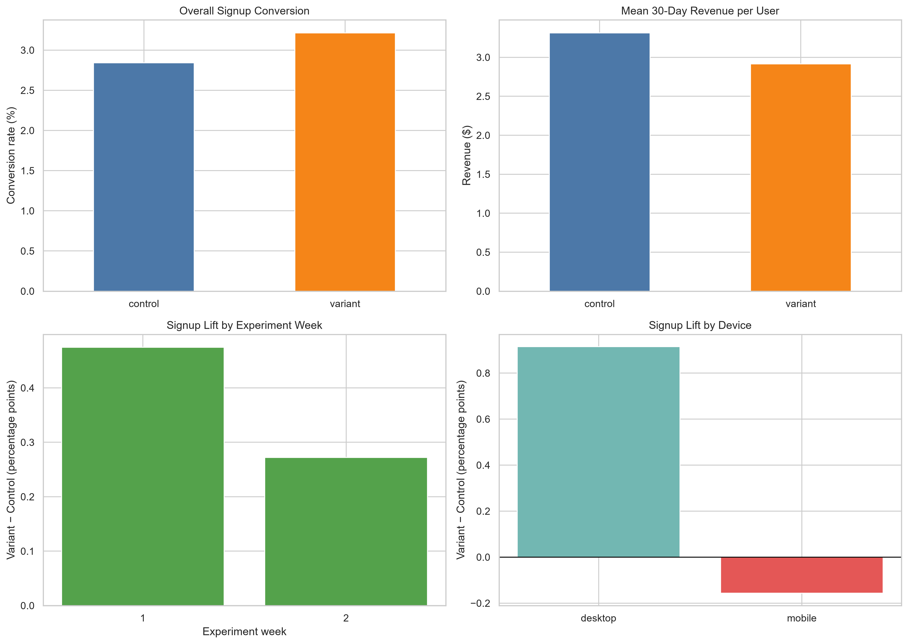

<div align="center">

# 📉 The Signup Win That Lost Revenue

### A/B Testing & Product Experimentation Analysis


**A product analytics case study showing why a statistically significant signup lift was not enough to launch a homepage redesign.**

[Executive decision](findings/05_executive_decision_memo.md) · [Experiment notebook](notebooks/04_ab_test_evaluation.ipynb) · [Statistical diagnostics](findings/04_experiment_diagnostics.md) · [LinkedIn](https://www.linkedin.com/in/pranava-sharma/)

</div>

---

## ⚡ 30-Second Recruiter View

> **The question:** Should a Growth team release a new homepage after signup conversion rises from 2.84% to 3.21%?
>
> **The finding:** The lift is statistically significant, but falls below the +0.5 percentage-point target. Mean 30-day revenue per user also declines significantly, and the signup benefit is concentrated on desktop.
>
> **The decision:** **Do not ship globally.** Investigate mobile friction and run a controlled desktop-only follow-up experiment with a predefined revenue guardrail.

| Decision signal | Result | Interpretation |
| --- | ---: | --- |
| Signup conversion | **+0.3728 pp**; p = 0.0150 | Evidence of a positive overall effect |
| 95% Wald CI | **+0.0724 to +0.6733 pp** | Excludes zero, but does not establish a lift above the +0.5 pp target |
| 30-day revenue per user | **−11.98%**; Welch p = 0.0323 | Revenue guardrail failed |
| Desktop signup lift | **+0.91 pp**; p = 0.0002 | Promising follow-up segment |
| Mobile signup lift | **−0.16 pp**; p = 0.3983 | No demonstrated mobile benefit |
| Device effect difference | **p = 0.0005** | Evidence that treatment effects differ by device |
| Week 2 vs Week 1 effect change | **p = 0.5089** | Observed decline does not establish novelty decay |

---

## 🧭 The Decision Trail

This portfolio moves from **product friction → customer retention → experiment evaluation → executive decision**.

| Analysis | Business question | Main finding | Evidence |
| --- | --- | --- | --- |
| Funnel | Where does the journey break? | Mobile Cart-to-Checkout conversion was **30.14%**, versus **61.14%** on desktop. | [Notebook](notebooks/02_funnel_analysis.ipynb) · [Findings](findings/02_funnel_friction.md) |
| Cohorts | When do customers stop returning? | Average M1 retention was **54.6%**; the curve then flattened among a smaller retained segment. | [Notebook](notebooks/03_cohort_retention.ipynb) · [Findings](findings/03_retention_dynamics.md) |
| Experiment | Does the redesign improve outcomes safely? | Signup improved, but revenue fell and the effect differed by device. | [Notebook](notebooks/04_ab_test_evaluation.ipynb) · [Findings](findings/04_experiment_diagnostics.md) |
| Decision | What should leadership do? | Reject a global launch; investigate mobile and re-test desktop under explicit guardrails. | [One-page memo](findings/05_executive_decision_memo.md) |

**Dataset boundary:** These are separate educational datasets. The funnel and cohort notebooks generate reproducible synthetic data; the A/B test uses the Topfolio-provided 50,000-user CSV. Results from one dataset are context for investigation, not proof of a causal relationship in another.

---

## 📊 Visual Evidence

### Where the product journey loses users



The mobile Cart-to-Checkout transition is the clearest funnel bottleneck. The analysis deduplicates tracking events at the user-and-stage level before calculating conversion.

### How customer retention changes



The M0–M6 matrix shows a steep first-month decline. Blank cells represent months that newer cohorts have not yet had time to reach.

### Why the homepage variant did not earn a global launch



The experiment improved the primary signup metric while regressing the revenue guardrail. Device and weekly views prevent the overall average from hiding important differences.

---

## 🔬 Experiment Methodology

The homepage experiment has **50,000 unique users**: 25,053 control and 24,947 variant. The notebook checks zero duplicates, zero missing values, valid outcome values, and assignment balance before interpreting results.

1. **Assignment integrity:** Chi-square sample ratio mismatch test against 50/50 allocation; p = 0.6355.
2. **Primary outcome:** Two-sample proportion Z-test for signup conversion, with a 95% Wald confidence interval for variant minus control.
3. **Business threshold:** Compare the observed signup lift and its confidence interval with the +0.5 percentage-point MDE.
4. **Revenue guardrail:** Welch's two-sample t-test for mean 30-day revenue per randomized user (`equal_var=False`).
5. **Stability and heterogeneity:** Compare treatment effects across Week 1 and Week 2, then across desktop and mobile.

**Interpretation discipline:** A significant Week 1 result and a non-significant Week 2 result do not prove that the effects differ. The direct week-to-week effect-change test was non-significant (p = 0.5089). Mobile's negative signup estimate alone was also non-significant; the desktop-versus-mobile effect difference was significant.

---

## 🚦 Business Recommendation

**Do not launch the variant globally.** The overall signup improvement does not establish that the +0.5 pp target was cleared, and the 30-day revenue guardrail regressed significantly.

The next product investigation should focus on mobile layout, CTA visibility, form errors, page speed, event tracking, and the path from signup to revenue. Growth and Analytics should pre-register a desktop-only follow-up test with a persistent control group, fixed analysis date, explicit signup target, and agreed revenue guardrail. The full reasoning is in the [executive decision memo](findings/05_executive_decision_memo.md).

---

## 📁 Repository Structure

```text
A-B-Testing-Product-Experimentation-Analysis-M1/
├── notebooks/
│   ├── 02_funnel_analysis.ipynb
│   ├── 03_cohort_retention.ipynb
│   └── 04_ab_test_evaluation.ipynb
├── findings/
│   ├── 02_funnel_friction.md
│   ├── 03_retention_dynamics.md
│   ├── 04_experiment_diagnostics.md
│   ├── 05_executive_decision_memo.md
│   └── figures/
│       ├── 02_funnel_by_device.png
│       ├── 03_cohort_retention_heatmap.png
│       └── m4_experiment_diagnostics.png
├── requirements.txt
├── .gitignore
└── README.md
```

## ▶️ Reproduce the Analysis

1. Create and activate a Python virtual environment in the repository folder.
2. Install dependencies with `python -m pip install -r requirements.txt`.
3. In VS Code, open the notebooks and select that environment as the Jupyter kernel.
4. Run notebooks **02** and **03** from top to bottom. They create their own seeded synthetic datasets.
5. Download `homepage_ab_test.csv` from the Topfolio M4 workspace and place it in a local `data/` folder within this project. Run notebook **04** from top to bottom.

The supplied A/B CSV is an input to notebook 04; it is not included in this public repository. The notebooks, results, charts, and decision documents make the analysis reviewable.

---

## 🧠 Skills Demonstrated

**Product analytics:** Funnel grain and deduplication · cohort retention and maturity · device segmentation · business guardrails  
**Experimentation:** SRM · two-proportion Z-test · Wald CI · MDE assessment · Welch t-test · temporal and segment effect comparisons  
**Decision-making:** Distinguishing statistical significance from business impact · documenting uncertainty · defending a launch recommendation

---

<div align="center">

**Built by [Pranava Sharma K](https://github.com/pranav376-hub)**

[LinkedIn](https://www.linkedin.com/in/pranava-sharma/) · [SQL Business Insights](https://github.com/pranav376-hub/sql-business-insights) · [Product Analytics SQL](https://github.com/pranav376-hub/sql-product-analytics) · [Stakeholder Dashboards](https://github.com/pranav376-hub/stakeholder-dashboards)

</div>